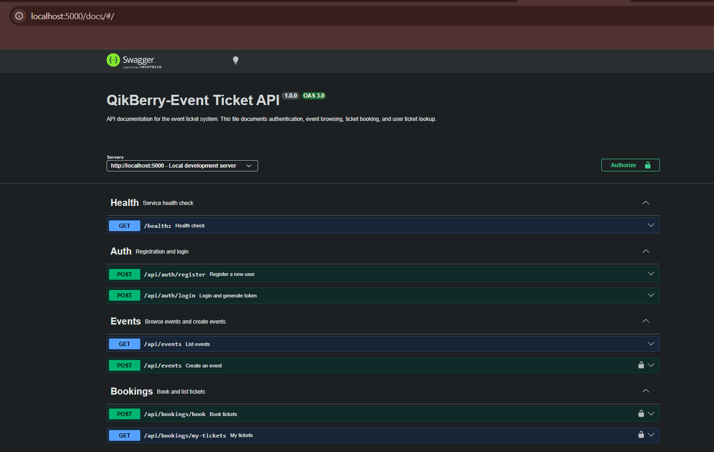

# QikBerry API



A backend API for an event and ticket booking system built with **Node.js**, **Express**, **TypeScript**, **Sequelize**, **MongoDB/Mongoose**, **JWT authentication**, and **Zod validation**.

This repository is organized as a **monorepo using npm workspaces**, so multiple packages can live under one codebase while still being managed cleanly with a single root install and shared lockfile.

---

## Overview

This project provides a secure REST API for:

* user registration and login
* admin-only event creation
* public event listing
* ticket booking
* viewing booked tickets
* API documentation through Swagger UI
* request validation and security middleware

The application is designed to be simple, readable, and production-friendly, with a clear separation between configuration, middleware, validation, controllers, and services.

---

## Tech Stack

* **Node.js** – runtime for the backend
* **Express** – web framework
* **TypeScript** – static typing and safer development
* **Sequelize** – SQL ORM used for relational data
* **Mongoose** – MongoDB ODM used for event and log documents
* **MySQL** – relational storage for users and bookings
* **MongoDB** – document storage for events and logs
* **JWT** – token-based authentication
* **bcryptjs** – password hashing
* **Zod** – request validation
* **Helmet** – security headers
* **CORS** – cross-origin access control
* **express-rate-limit** – request throttling
* **Swagger UI** + **YAML** – API documentation
* **esbuild** – fast build bundling
* **nodemon** – development auto-restart

---

## Why npm is used here

npm is used for a few important reasons:

### 1. Dependency management

npm installs and tracks all runtime and development dependencies in one place.

### 2. Script execution

npm scripts are used to standardize common tasks like:

* starting the app
* building the source
* running development mode
* compiling TypeScript

### 3. Workspaces in a monorepo

Since this project is a monorepo, npm workspaces help manage multiple packages from the root level.

That means:

* one root `package-lock.json`
* one install command
* shared dependencies
* cleaner package organization
* easier scaling if frontend, backend, shared utils, or admin apps are added later

### 4. Consistent project workflow

npm makes the project easier to run across machines because the scripts are the same for every developer.

---

## Monorepo + npm workspaces

This project is placed under a monorepo structure using npm workspaces.

That setup is useful when:

* the backend and other packages need to live together
* shared code should be reused across packages
* the repository should stay organized as it grows
* installs and scripts should be controlled from the root

Typical workspace benefits:

* avoids duplicate installations
* keeps versions aligned
* makes shared utilities easier to manage
* reduces maintenance overhead

---

## Project Features

### Authentication

* Register new users
* Login existing users
* Issue JWT tokens
* Hash passwords using bcrypt

### Authorization

* Protect private routes using JWT middleware
* Restrict event creation to admins only

### Events

* Create events
* List events with pagination
* Store event data in MongoDB

### Bookings

* Book tickets for available events
* Prevent overselling with ticket availability checks
* Save booking records in MySQL

### Logging

* Save important actions into logs
* Keep logs separate from transactional data

### Validation

* Validate request body, params, and query using Zod
* Return structured validation errors

### Security

* Helmet for security headers
* CORS configuration
* Rate limiting
* Basic sanitization to reduce unsafe payload risks

### Docs

* Swagger UI available in development mode at `/docs`

---

## Architecture Notes

This codebase intentionally uses **two data layers**:

### MongoDB + Mongoose

Used for:

* `Event`
* `Log`

This fits flexible document-style data well, especially for event metadata and audit logs.

### MySQL + Sequelize

Used for:

* `User`
* `Booking`

This is better for structured relational data like users, roles, and booking records.

---

## Why these packages are used

### `express`

Used to create the HTTP API, define routes, and attach middleware.

### `dotenv`

Loads environment variables from `.env`.

### `jsonwebtoken`

Creates and verifies JWT tokens for auth.

### `bcryptjs`

Hashes user passwords securely before saving them.

### `zod`

Validates incoming requests and keeps input handling strict and predictable.

### `helmet`

Adds common security-related HTTP headers.

### `cors`

Controls which frontends are allowed to access the API.

### `express-rate-limit`

Helps reduce brute-force and abuse risk by limiting request frequency.

### `mongoose`

Handles MongoDB schemas and queries for events and logs.

### `sequelize`

Handles MySQL models, transactions, and SQL data operations.

### `swagger-ui-express`

Serves interactive API documentation.

### `yaml`

Reads the OpenAPI spec file used by Swagger UI.

### `esbuild`

Bundles the TypeScript output into a single distributable file quickly.

### `nodemon`

Restarts the server automatically during development when files change.

---

## Scripts

```bash
npm run dev
npm run build
npm run build:tsc
npm start
```

### What each script does

* `npm run dev`
  Runs the bundled server with `nodemon` for development.

* `npm run build`
  Bundles the project using `esbuild`.

* `npm run build:tsc`
  Compiles TypeScript to verify types and emit JS output.

* `npm start`
  Starts the compiled production build.

---

## Setup

### 1. Install dependencies

```bash
npm install
```

### 2. Create `.env`

```env
PORT=5000
NODE_ENV=development

JWT_SECRET=your_secret_here
JWT_EXPIRES_IN=2h
CORS_ORIGIN=http://localhost:3000

MYSQL_HOST=localhost
MYSQL_PORT=3306
MYSQL_DATABASE=event_ticket_system
MYSQL_USER=root
MYSQL_PASSWORD=your_password_here

MONGODB_URI=mongodb://localhost:27017/event_ticket_system
```

### 3. Build the project

```bash
npm run build
```

### 4. Start development mode

```bash
npm run dev
```

### 5. Start production mode

```bash
npm start
```

---

## API Endpoints

### Auth

* `POST /api/auth/register`
* `POST /api/auth/login`

### Events

* `GET /api/events`
* `POST /api/events`
  Admin only

### Bookings

* `POST /api/bookings/book`
* `GET /api/bookings/my-tickets`

### Health

* `GET /healthz`

### Docs

* `GET /docs`
  Available only in development mode

---

## Validation Rules

The API uses Zod schemas to validate input before it reaches the controller logic.

Examples:

* email must be valid
* password must meet minimum length
* event fields must satisfy length and type rules
* `eventId` must be a valid Mongo ObjectId
* pagination values must be safe and bounded

This prevents invalid data from entering the service layer.

---

## Error Handling

The project uses a centralized error pattern:

* custom `AppError` class
* async handler wrapper
* validation error conversion
* global 404 handler
* global error handler

This keeps responses consistent and easier to debug.

---

## Security Highlights

* JWT-protected routes
* admin-only event creation
* password hashing
* input validation
* request body size limits
* rate limiting
* security headers via Helmet
* payload sanitization for unsafe object keys

---

## Project Structure

```bash
src/
├── app.ts
├── main.ts
├── config/
├── controllers.ts
├── middleware.ts
├── models/
├── routes.ts
├── services/
├── utils.ts
└── validators.ts
```

---

## What is intentionally not included

This assessment-focused project does **not** include:

* Vitest
* unit tests
* Docker

That is intentional because they were **not part of the interview assessment scope**. The implementation stays aligned with the requested backend features instead of adding extra infrastructure or test layers that were not asked for.

---

## Summary

This project demonstrates:

* clean Express backend structure
* secure authentication and authorization
* mixed SQL + MongoDB persistence
* schema validation
* production-oriented middleware
* workspace-friendly monorepo management
* fast build and simple deployment workflow

It is intentionally practical, easy to run, and easy to extend.
